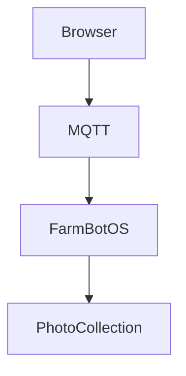

# Research Document Workbench

A local Flask application for:

- Markdown notebooks
- LaTeX paper development
- BibTeX editing
- editable `.diagram` graph sources
- PDF compilation
- Markdown math rendering
- Mermaid diagrams
- syntax highlighting
- project folders
- source-preserving import/export

The source editor always preserves raw Markdown, LaTeX, and BibTeX, so content can be copied directly into Overleaf, TeXstudio, VS Code, or another editor.

## 1. Install system dependencies

On Pop!_OS / Ubuntu:

```bash
sudo apt update
sudo apt install -y python3-venv latexmk texlive-latex-extra
```

For broader scientific paper support:

```bash
sudo apt install -y \
  texlive-science \
  texlive-bibtex-extra \
  biber
```

## 2. Create the virtual environment

```bash
cd Research_Document_Workbench
python3 -m venv venv
source venv/bin/activate
pip install -r requirements.txt
```

The reusable `tech_documents` core itself uses only the Python standard library; `Flask` is needed only for the standalone browser application.

## 3. Run the standalone app

Preferred launcher:

```bash
python run.py
```

The original launcher remains supported:

```bash
python app.py
```

Open:

```text
http://127.0.0.1:5050
```

## Reusable module API

The document engine can be embedded without importing Flask:

```python
from tech_documents import DocumentEngine

engine = DocumentEngine("/path/to/workspace-root")
engine.create_project("paper")
engine.save_file("paper", "notes.md", "# Notes\n")
projects = engine.list_projects()
```

The future unified Project Assistant should integrate through `DocumentEngine` rather than importing `tech_documents.web` or the standalone browser code.

## Project layout

```text
Research_Document_Workbench/
├── tech_documents/
│   ├── api.py                  # public DocumentEngine boundary
│   ├── compilation.py
│   ├── paths.py
│   ├── diagrams/
│   │   ├── format.py
│   │   └── assets.py
│   └── web/                    # standalone browser application
│       ├── app.py
│       ├── templates/
│       └── static/
├── documents/
├── builds/
├── tests/
├── app.py                      # backward-compatible launcher
├── run.py                      # preferred launcher
├── diagram_format.py           # backward-compatible import shim
├── diagram_assets.py           # backward-compatible import shim
├── requirements-core.txt
└── requirements.txt
```

See `MODULE.md` for the module boundary and `docs/ARCHITECTURE.md` for the integration architecture.

## Markdown support

The Markdown editor supports:

- headings
- lists and task lists
- tables
- fenced code blocks
- syntax highlighting
- inline math with `$...$`
- display math with `$$...$$`
- Mermaid diagrams

Example:

````markdown
## Architecture



$$
T_{\text{next}} = T_{\text{current}} + \Delta t
$$
````

## LaTeX workflow

Open a `.tex` file and edit the source directly.

Press **Compile LaTeX** to run:

```bash
latexmk -pdf -interaction=nonstopmode -halt-on-error
```

The resulting PDF appears in the preview pane.

The app falls back to Tectonic when `latexmk` is unavailable.

## Security

The application binds to `127.0.0.1` by default and is intended for local use.

The LaTeX compiler executes the source you provide. Do not compile untrusted `.tex` projects without reviewing them first.

## Notes

The Markdown renderer, KaTeX, Mermaid, and syntax highlighter are loaded from CDNs. Internet access is required for those browser-side libraries unless they are downloaded and served locally.

## Project filesystem sidebar

The **Files** panel is a recursive project-directory view rather than a flat file list.

- Click a folder to expand/collapse it and make it the active destination.
- **+F** creates a text document inside the selected folder.
- **+D** creates a folder inside the selected folder.
- **↑** uploads a file into the selected folder.
- Right-click a file or folder to open its context menu with **Rename**, **Move**, and **Delete** actions.
- Drag a file or folder onto another folder (or onto the project-root row) to move it.
- Nested `.md`, `.markdown`, `.tex`, `.bib`, `.txt`, and `.diagram` files can be opened, edited, autosaved, and compiled where applicable.
- Other project assets are shown in the tree and can still be moved, renamed, deleted, or downloaded as part of the project archive, even though they are not editable in the text editor.

Folder deletion is recursive and always asks for confirmation in the browser.


## Undo and redo

The text editor keeps an explicit per-file edit history rather than relying only on the browser textarea history.

- **Ctrl+Z** / **Cmd+Z**: undo
- **Ctrl+Shift+Z** / **Cmd+Shift+Z**: redo
- **Ctrl+Y**: redo
- The toolbar also contains **Undo** and **Redo** buttons.
- Typing and backspace/delete operations are coalesced into short editing bursts so undo does not normally step backward one character at a time.
- Toolbar insertions and Tab indentation create explicit undo steps.
- Histories are kept separately for each open project file during the browser session and follow files when they are renamed or moved in the sidebar.

## `.diagram` source format

`.diagram` files are editable first-class project files. They are parsed into an internal graph and rendered through Mermaid in the preview pane. The format is intentionally small so the later Diagram Builder can generate it without locking the project to Mermaid syntax.

Basic syntax:

```text
Node Label [optional-type]
  -> Target Label [optional-type]
  :: optional note attached to the current node
```

The same node label can be referenced multiple times; those references resolve to one graph node. A compact inline edge is also accepted:

```text
Source [service] -> Target [database]
```

Lines beginning with `//` are comments. Current type names are free-form identifiers such as `interface`, `service`, `database`, `hardware`, and `custom`. Types are stored as node metadata; visual style presets are intentionally left for the Diagram Builder step.

Example:

```text
Modified FarmBot Web Interface [interface]
  -> Local FarmBot Web App [service]

Local FarmBot Web App
  -> Rails API [service]
  -> Database [database]

Rails API
  -> Message Broker [service]

Message Broker
  -> FarmBot OS / Raspberry Pi 4 [hardware]

FarmBot OS / Raspberry Pi 4
  -> Custom Experiments [custom]
  -> Farmduino [hardware]

Custom Experiments
  -> Physical FarmBot [hardware]

Farmduino
  -> Physical FarmBot

Physical FarmBot
  :: Motors / Camera
```

The backend parser exposes the graph as nodes and edges, can serialize it back to canonical `.diagram` source, and generates plain Mermaid for the live preview. Syntax problems are shown in the preview with line numbers instead of silently failing.

## Diagram Builder

Open any `.diagram` file and click **Diagram Builder** in the editor toolbar. The builder is a focused two-pane workspace: the lightweight diagram source remains editable on the left while a styled Mermaid rendering updates live on the right.

The builder currently automates the presentation work that normally makes hand-written Mermaid diagrams tedious:

- automatic graph layout from the `.diagram` node/edge source;
- **Top → Bottom**, **Left → Right**, **Bottom → Top**, and **Right → Left** orientations;
- deterministic style presets for **Architecture**, **Research**, **Pipeline**, and **Minimal** diagrams;
- semantic shapes and colors for `interface`, `service`, `database`, `hardware`, and `custom` nodes;
- clickable type-helper buttons for inserting the supported node annotations;
- live node/edge counts and line-numbered syntax errors;
- one-click **Apply to file**, which writes the chosen direction and preset back into the `.diagram` source as ordinary directives and creates a normal undo step.

Example source with builder settings:

```text
@direction TB
@preset architecture

Modified FarmBot Web Interface [interface]
  -> Local FarmBot Web App [service]

Local FarmBot Web App
  -> Rails API [service]
  -> Database [database]

Rails API
  -> Message Broker [service]

Message Broker
  -> FarmBot OS / Raspberry Pi 4 [hardware]

FarmBot OS / Raspberry Pi 4
  -> Custom Experiments [custom]
  -> Farmduino [hardware]

Custom Experiments
  -> Physical FarmBot [hardware]

Farmduino
  -> Physical FarmBot

Physical FarmBot
  :: Motors / Camera
```

The `.diagram` file remains the source of truth. The visual builder does not store a separate proprietary graph representation, so diagrams remain diffable and editable as plain text.

SVG/PNG/PDF export and one-click insertion into Markdown/LaTeX are intentionally left for the next steps.

## Diagram export and document insertion

The Diagram Builder can now turn the current `.diagram` source into reusable project assets without leaving the workbench.

### Export to the project

Use **Output base path** to choose a project-relative stem such as:

```text
figures/farmbot_architecture
```

Then choose one of:

- **Save SVG** — keeps the diagram as a resolution-independent vector asset.
- **Save PNG** — rasterizes the SVG at high resolution for general-purpose use.
- **Save PDF** — creates an A4 PDF containing a high-resolution rendering of the diagram, useful for LaTeX papers and slide workflows.

Exports are written directly into the project. Missing output folders such as `figures/` are created automatically, and the filesystem sidebar refreshes after export.

The `.diagram` source is saved before export so the generated asset always has a reproducible source file in the project.

### Export + Insert

The builder also lists every Markdown and LaTeX document in the active project.

For Markdown targets:

- SVG or PNG can be selected.
- SVG is selected by default.
- The workbench appends a normal relative Markdown image reference, for example:

```markdown

```

Project-relative images are rewritten only for the browser preview, so the Markdown source itself stays portable.

For LaTeX targets:

- PDF or PNG can be selected.
- PDF is selected by default.
- Choose **Single column** or **Double column**.
- The figure is inserted before the final `\end{document}` when one is present.
- A figure caption and label can be supplied in the builder.

Single-column example:

```latex
\begin{figure}[t]
    \centering
    \includegraphics[width=\linewidth]{figures/farmbot_architecture.pdf}
    \caption{FarmBot architecture.}
    \label{fig:farmbot-architecture}
\end{figure}
```

Double-column mode uses `figure*` and `\textwidth` instead.

The workbench warns if the target LaTeX file does not appear to load `graphicx`. Existing references to the same generated asset are not inserted twice by default.

### Browser-side export libraries

Mermaid remains responsible for graph layout and SVG rendering. PNG generation is performed from the rendered SVG in the browser. PDF generation uses jsPDF, loaded from a CDN like the existing Markdown, KaTeX, Mermaid, and syntax-highlighting libraries. Consequently, the first browser load requires internet access unless those libraries are later vendored locally.
